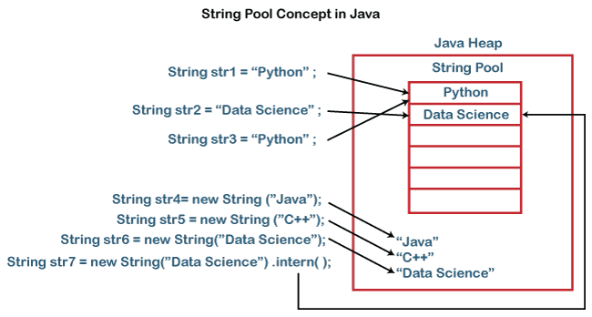
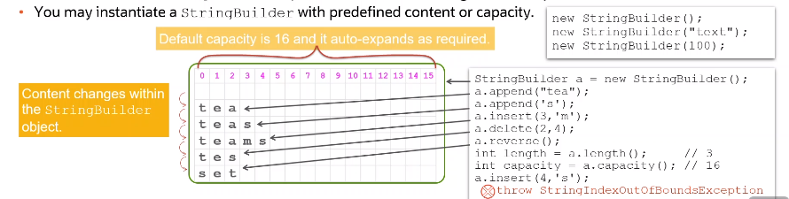

# Java Programming Langauge
Java Learning Guide


# Table of Contents

1. [Primitive Types](#primitive-types)
2. [Operators](#operators)
3. [Type Casting](#type-casting)
4. [Wrapper Classes](#wrapper-classes)
5. [String](#string)
    - [String Pool](#string-pool)
    - [String Operations](#string-operations)
    - [String Indexing](#string-indexing)
    - [Text Blocks](#text-blocks)
    - [String Builder](#string-builder)
6. [Date and Time](#local-date-and-time)
7. [Switch Keyword](#switch-keyword)
    - [Control Flow](#control-flow)
    - [Switch Expressions](#switch-expression)
    - [Switch Statements](#switch-statement)
 

## Primitive Types

| Data Type | Size | Min Value | Max Value | Default | Comments |
| --- | --- | --- | --- | --- | --- |
| byte | 8 bits | -128 | 127 | 0 |  |
| short | 16 bits | -32,768 | 32,767 | 0 |  |
| int | 32 bits | - 2,147,483,648 (2^31) | 2,147,483,647 (2^31 -1) | 0 |  |
| long | 64 bits | -9,223,372,036,854,775,808 (-2^63) | 9,223,372,036,854,775,807 (2^63 -1) | 0L |  |
| float | 32 bits | 1.4E-45 | 3.4028235E+38 | 0.0F |  |
| double | 64 bits | 4.9E-324 | 1.7976931348623157E+308 | 0.0 |  |
| char | 16 bits | 0 | 65,535 | '\u0000' | [Java Unicodes](https://www.javatpoint.com/unicode-system-in-java) |
| boolean | 1 bit |  |  | false |  |

[Top 🔝](#table-of-contents)

## Operators

| Operator | Precedence |
| --- | --- |
| postfix increment and decrement | ++ -- |
| prefix increment and decrement, and unary | ++ -- + - ~ ! |
| multiplicative | * / % |
| addictive | + - |
| bit shift | << >> >>> |
| relational | < > <= >= instanceof |
| equality | == != |
| bitwise AND | & |
| bitwise exclusive OR | ^ |
| bitwise inclusive OR | \| |
| logical AND | && |
| logical OR | \|\| |
| ternary | ?: |
| assignment | = += -=*= /= %= &= ^= \|= <<= >>= >>>= |

[Top 🔝](#table-of-contents)

## Type Casting

- Smaller types automatically casted to bigger types. 
- byte -> short -> char -> int -> long -> float -> double
- Explicit type casting is required to assign bigger types to smaller ones.
- Beware of overflow while type casting.
- Result of arthmetic operations on types smaller than int is an int.

```java
byte a = 127, b = 5;

// ❌ compilation fails
byte c = a + b;
int d = a + b;  // d = 132

// ⚠️ e is -124 (type overflow, because 127 is the max byte value)
byte e = (byte) (a + b);

// ⚠️ f is 25 ( a/b is 25 because it is an int)
int f = a / b;

// ⚠️ g is 25.0F (result of a/b )
float g = a / b; 

// ⚠️ h is 25.0F (explicitly casted to float, but a/b is still 25)
float h = (float) (a/b);

// ✅ when either a or b
float i = (float) a / b;

// ⚠️ explicit casting is required, because b + 1 is an int
b = (byte) (b + 1);

b++;    // no casting is required for ++ and -- operators

char x = 'x'
char y = ++x;   // arithmetic operations work with char codes
```
[Top 🔝](#table-of-contents)

## Wrapper classes

- Wrapper classes apply object oriented capabilities to primitives
- Wrapper classes provides constants such as max and min values of each type.

| Primitive Type | Wrapper Class |
| --- | --- | 
| byte | [Byte](https://docs.oracle.com/en/java/javase/17/docs/api/java.base/java/lang/Byte.html) | 
| short | [Short](https://docs.oracle.com/en/java/javase/17/docs/api/java.base/java/lang/Short.html) |
| int | [Integer](https://docs.oracle.com/en/java/javase/17/docs/api/java.base/java/lang/Integer.html) |
| long | [Long](https://docs.oracle.com/en/java/javase/17/docs/api/java.base/java/lang/Long.html) |
| float | [Float](https://docs.oracle.com/en/java/javase/17/docs/api/java.base/java/lang/Float.html)  |
| double | [Double](https://docs.oracle.com/en/java/javase/17/docs/api/java.base/java/lang/Double.html) |
| char | [Character](https://docs.oracle.com/en/java/javase/17/docs/api/java.base/java/lang/Character.html) |
| boolean | [Boolean](https://docs.oracle.com/en/java/javase/17/docs/api/java.base/java/lang/Boolean.html) |


```java
Integer b = Integer.valueOf(12);    // Integer object
int val = b.intValue();             // get primitive value using ___Value() methods

Integer obj = 12;     // auto boxing
int value = obj;      // auto unboxing

// String to primitive
float e = Float.valueOf("12.12");    
float f = Float.parseFloat("12.12");        // string to primitive using parse___() methods

// Primitive to String
String str = String.valueOf(f);
```
- All wrapper classes are immutable and signed.
- [BigDecimal](https://docs.oracle.com/en/java/javase/17/docs/api/java.base/java/math/BigDecimal.html)
[Top 🔝](#table-of-contents), [BigInteger](https://docs.oracle.com/en/java/javase/17/docs/api/java.base/java/math/BigInteger.html) Classes can be used for arbitary precision. 

## String

- String is a class (not primitive). Its instance represent sequence of characters.
- String object can be instantiated by using *new* keyword. String objcet (It is the only java object which) allows simplified instantiation. It is the recommended way to instantiate a string in java.

```java
char[] text = {'H', 'E', 'L', 'L', 'O'};

String a = new String(text);
String b = new String("Hello");

// simplified instantiation
String c = "Hello";
```
[Top 🔝](#table-of-contents)

### String Pool

- JVM optimise memory allocated to store String objects by maintaining a *single copy of each String literal* in the [String Pool memory Area](https://www.javatpoint.com/string-pool-in-java), *regardless of how many variables reference this copy*. This process is called interning.
- intern() method is used to get a copy of String literal. 

```java
// All variables point to same reference

String a = "hello";
String b = a;
String c = "hello";
```



[Top 🔝](#table-of-contents)

### String operations

- String objects are immutable.
- String operations such as trim(), concat(), toLowerCase(), toUpperCase(), and so on would always return a new String object, but wouldn't modify the original String.

```java
String a = " Hello ";
a.trim();       // it return a new String object
a = a.trim();   // an object can be reassigned

String x = a + " World"; // same as a.concat(" World");
```

- *+* operator can be used in place of concat() method.

```java
String s = "";
s = 1 + 1 + "abc";  // 2abc
s = "java" + 1 + 7;  // java17
s = "xyz" + (1+1);  //xyz2
```

- *==* operator is used to check the if two references are pointing to the same value or not. In order to check the values,equals() method should be used.

```java
String str1 = "Hello";
String str2 = "Hello";
String str3 = new String("Hello");

// because a and b both point to same value in string pool
str1 == str2    // true

str2 == "Hello"             // true
str2 == str3                // false
str3 == new String("Hello") // false

str1.equals(str2)                   // true
str2.equals("Hello")                // true
str2.equals(str3)                   // true
str3.equals(new String("Hello"))    // true    
```
[Top 🔝](#table-of-contents)

### String Indexing

```java
String a = "HelloWorld";
String b = a.substring(0,5);    // 0 inclusive, 5 exclusive
int i = a.indexOf('o');         // 4 index starts from 0
char h = a.charAt(0);           // 'H'
int size = a.length();          // 10 length is method, not a attribute
int p = charAt(10);             // out of bounds exception
```
[Top 🔝](#table-of-contents)

### Text Blocks

A text block is a multiline string literal that avoids the need for most escape sequences.
```java
String html = """
              <html>
                <body></body>
              </html>
              """;
```

A text block begings with three double-qoute charcaters followed by a `line terminator`.
```java
// ⚠️ no line terminator after opening delimiter
String a = """ """;
// ⚠️ you can't put a text block on a single line
String name = """Itachi Uchiha""";
// ⚠️ line termination missing for qoutes
String codes = """red
                  green
                  blue
                  """;
// ✅ ok
String codes = """
                red
                green
                blue
                """;
// no need to escape the embedded double qoutes
String source = """
                String msg = "Hello World";
                System.out.println(message);
                """;
// ⚠️ no closing delimiter (EOF error)
String b = """
            ";
```

[Text Blocks tutorial](https://docs.oracle.com/en/java/javase/15/text-blocks/index.html)

[Top 🔝](#table-of-contents)

### String Builder
- String Builder objects are mutable.
- Handling text using StringBuilder reduces the number of String objects.



[Top 🔝](#table-of-contents)

# Local Date and Time

- Date and Time can be created using [LocalDate](https://docs.oracle.com/en/java/javase/17/docs/api/java.base/java/time/LocalDate.html), [LocalTime](https://docs.oracle.com/en/java/javase/17/docs/api/java.base/java/time/LocalTime.html) and [LocalDateTime](https://docs.oracle.com/en/java/javase/17/docs/api/java.base/java/time/LocalDateTime.html)

```java
LocalDate today = LocalDate.now();
LocalTime time = LocalTime.now();
LocalDateTime currentDateTime = LocalDateTime.now();


LocalDate foolsDay = LocalDate.of(2019, Month.APRIL, 1);
// LocalTime.of(hrs, mins, secs, nanosecs)
LocalTime someTime = LocalTime.of(10, 9);  


LocalDateTime someDateTime = foolsDay.atTime(someTime);

```

## Switch Keyword

### Control Flow

``` text
switch( <expression> ) {
    case <label>: 
        // logic
    case <label>:
        // logic
    default:
        //logic
}
```

- Switch expression must be of the following types:
byte, short, int, char, String, enum
- Case labels must mactch expression type.
- Execution flow continues until the end of switch unless break is specified for the matching case.
- default case is executed if none of the cases matches the expression. default doesn't need to be the last statement. It is optional i.e, we can omit default case if not necessary.

```java
switch(month) {
    case 1: case 3: case 5: case 7: case 8: case 10: case 12:
        String days = "31 days";
        System.out.println(days);
    case 4: case 6: case 9: case 11:
        // ❌ This is not valid
        // String days = "30 days";  

        // ✅ This is valid
        days = "30 days";
        System.out.println(days);
    case 2:
        if(isLeapYear) {
            days = "29 days";
        } else {
           days = "28 days";
        }
        System.out.println(days);
}
```
- Scope of a varaible is at whole switch statement level, not at case level

### Switch Expression

- Prevents fall through
- Eliminates the need for break statements
- It contains lambda style syntax
- Many labels can be clubbed into a single case separated by commas
- Scope of a variable is the case where it is declared.

```java
switch(month) {
    case 1, 3, 5, 7, 10, 12 -> System.out.println("31 days");
    case 4, 6, 9, 11 -> System.out.println("30 days");
    case 2 -> {
        String days = "28 days";
        if(isLeapYear) {
            days = "29 days";
        } 
        System.out.println(days);
    }
    default -> {
        // ✅ Valid
        String days = "Invalid Month";
        System.out.println(days);
    }
}
```
### Switch Statement

- All cases must return a value. Switch statement ends with a *semicolon*
- For single lines, use lamda style syntax to return value
- For blocks, use *yield* keyword to return a value. yield works only in switch statements.
- Using yield as a varaible outside switch is allowed.

```java
int numberOfDays = switch(month) {
    case 1, 3, 5, 7, 10, 12 -> 31;
    case 4, 6, 9, 11 -> 30;
    case 2 -> {
        if(isLeapYear) {
            yield 29;
        } else {
            yield 28;
        }
    }
    default -> -1;
```